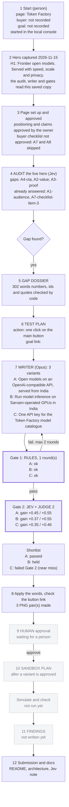

# Token Factory: run probe3-20261115-183113, step by step

Same steps as docs/architecture.html. Grey dashed = not reached yet.

```mermaid
flowchart TD
    classDef todo fill:#f4f5f7,stroke:#aab,stroke-dasharray:4 3,color:#778
    classDef gate stroke-width:3px
    classDef stop fill:#FDE2E2,stroke:#D14B4B,color:#5a1010
    S["1 Start (person)<br/>page: Token Factory<br/>buyer: not recorded<br/>goal: not recorded<br/>started in the local console"]
    C["2 Hero captured 2026-11-15<br/>H1: Frontier open models. Served with speed, scale and privacy.<br/>the audit, writer and gates read this saved copy"]
    P["3 Page set up and approved<br/>positioning and claims approved by the owner<br/>buyer checklist not approved: A7 and A8 skipped"]
    A["4 AUDIT the live hero (Jev)<br/>gaps: A4-cta, A2-value, A3-proof<br/>already answered: A1-audience, A7-checklist-item-3"]
    D{"Gap found?"}
    H["5 GAP DOSSIER<br/>302 words numbers, ids and quotes checked by code"]
    T["6 TEST PLAN<br/>action: one click on the main button<br/>goal link:"]
    W["7 WRITER (Opus): 3 variants<br/>A: Open models on an OpenAI-compatible API, served from India<br/>B: Run model inference on Sarvam-operated GPUs in India<br/>C: One API key for the Token Factory model catalogue"]
    G1["Gate 1: RULES, 1 round(s)<br/>A: ok<br/>B: ok<br/>C: ok"]:::gate
    G2["Gate 2: JEV + JUDGE 2<br/>A: gain +0.45 / +0.55<br/>B: gain +0.37 / +0.55<br/>C: gain +0.35 / +0.46"]:::gate
    SL["Shortlist<br/>A: passed<br/>B: held<br/>C: failed Gate 2 (near miss)"]
    PX["8 Apply the words, check the button link<br/>3 PNG pair(s) made"]
    AP["9 HUMAN approval<br/>waiting for a person"]:::todo
    SP["10 SANDBOX PLAN<br/>after a variant is approved"]:::todo
    SB["Simulate and check<br/>not run yet"]:::todo
    FD["11 FINDINGS<br/>not written yet"]:::todo
    DOC["12 Submission and docs<br/>README, architecture, Jev note"]
    S --> C --> P --> A --> D
    D -- yes --> H --> T --> W --> G1
    G1 -- fail, max 2 rounds --> W
    G1 -- pass --> G2 --> SL
    SL --> PX --> AP
    AP -- approve --> SP --> SB --> FD --> DOC
```
